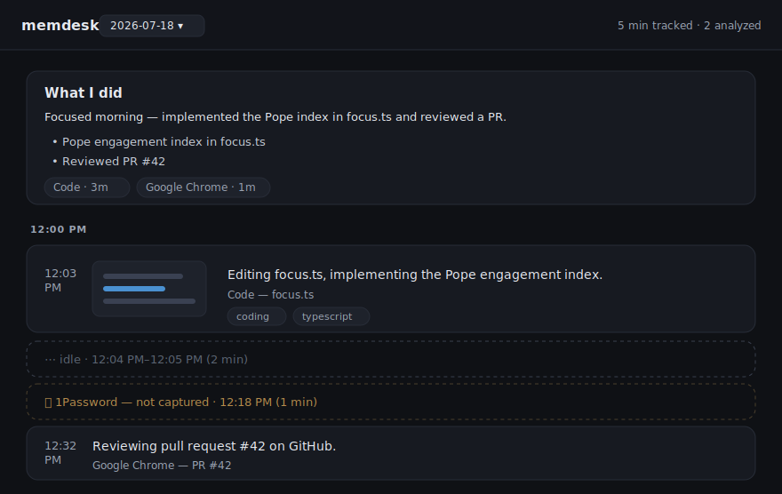

# memdesk

screenshots my screen every minute, figures out what i was doing, dumps it to json i can scroll through. so i can actually answer "what did i even do today".

macOS only. bun + typescript.

[](https://github.com/enkhbold470/memdesk/actions/workflows/ci.yml)
[](LICENSE)



## the idea

every minute: grab the screen → if it actually changed since last time, read the text off it (macOS OCR, on-device) → ask the LLM "what's this person doing" → write a line to `data/YYYY-MM-DD.jsonl`. nothing happens on idle minutes so it doesn't spam the endpoint or my disk.

screenshots **stay on the machine** in the default mode — only the OCR'd text leaves. see the OCR note below for why.

## cloud, with a local fallback

two backends:

- **cloud** — an openai-compatible endpoint (arkor), `gemma-4-31B-it`. this is the default.
- **local** — [ollama](https://ollama.com), `gemma4:e2b`. the fallback, for when you're offline.

`"provider": "auto"` (the default) goes to cloud first and only reaches for ollama when cloud doesn't answer. that ordering is deliberate: a local model big enough to be useful will fight your actual work for RAM, so it should only spin up when it's the only option. the local model is **never loaded** while cloud is working — the health check reads a manifest, it doesn't touch the weights.

if cloud fails, it drops to local and stops trying cloud first for a minute, so an offline afternoon doesn't burn a 30s timeout on every single frame. same in reverse.

```bash
ollama pull gemma4:e2b     # ~7 GB, optional — only needed for the offline fallback
bun run check              # tells you which one it'd use and why
```

because the choice can vary per minute, **every entry records which backend answered it** (`analysis.provider`, `"local"` or `"cloud"`) and the timeline shows it as a small badge. so you can always tell where a given minute's screen text went.

want to force it? pin it:

```json
{ "provider": "local" }
```

`"local"` never falls back — if ollama's down the entry just fails, and `bun run reanalyze` picks it up later. `"cloud"` never touches ollama at all, not even the health check.

heads up on model size: on a 16 GB machine `gemma4:12b` and up will make things crawl. `e2b` is the small one and it's what the default expects.

## running it

```bash
bun install
cp .env.example .env      # put your endpoint + key in
bun run check             # sanity check: compiles the OCR bit, does one round trip
bun start                 # the loop. ctrl-c to stop
```

then to look at it:

```bash
bun run server            # http://localhost:4319
bun run digest            # writes today's "what i shipped" summary (pass a date for another day)
```

first run macOS will nag about Screen Recording. give it to whatever's running `bun start` (your terminal / vscode), quit + reopen it, done. if screenshots come out black that's what you missed.

leave it running all day:

```bash
bun run install-daemon    # launchd, starts at login
bun run uninstall-daemon
```

other bits: `bun run pause` / `bun run resume` (stop capturing for a bit), `bun run reanalyze` (retry the LLM on lines that failed, as long as the png's still around), `bun run demo` (synthetic data for screen recordings — see below), `bun test`.

## demoing it

the timeline renders **your actual screen history**, so recording it to share would publish whatever was on screen. there's a separate synthetic dataset for that:

```bash
bun run demo          # generate a fake couple of days + serve them
bun run demo:serve    # re-serve without regenerating
```

it writes to `demo/` and never reads or touches `data/` or `screenshots/`. the frames are drawn, not captured — abstract mockups of an editor, a terminal, a browser — so there's no real text in them. every entry carries `synthetic: true` in the json and the UI shows a **demo data** pill in the header, which stays visible in a recording. don't remove it: a timeline is a claim about how someone spent their day, and a fabricated one has to say so.

`demo/` is gitignored — regenerate it with `bun run demo`.

## the OCR thing

wanted to just send the screenshot to the model. the endpoint i'm using (vllm behind a gateway) only takes text `content` — it 400s on the image array. so instead: OCR the screenshot locally with the macOS Vision framework (tiny swift helper, compiles itself on first run — needs xcode command line tools), send the text. bonus: the images never leave.

if you've got a real multimodal endpoint, flip `"analysisMode": "vision"` in `config.json` and it sends the image instead. code's still there.

## config

optional `config.json` in the root, all keys optional (see `config.example.json`):

- `intervalSec` — 60
- `changeThreshold` — 5. how different a frame has to be to count as "changed" (higher = fewer calls, more stuff skipped)
- `retentionDays` — 14. pngs older than this get deleted. the json stays forever
- `analysisMode` — `"ocr"` (default) or `"vision"`
- `provider` — `"auto"` (default), `"local"`, or `"cloud"`. see above
- `excludeApps` — `["1Password", "Messages"]`. these never get captured at all
- `display` — `"main"`
- `port` — 4319

`.env`:

```
OPENAI_BASE_URL=...            # cloud
OPENAI_API_KEY=...
VISION_MODEL=gemma-4-31B-it

OLLAMA_BASE_URL=http://localhost:11434/v1   # local, both optional
OLLAMA_MODEL=gemma4:e2b
```

## where stuff lives

```
data/2026-07-18.jsonl          one line per minute
data/2026-07-18.summary.json   the daily digest
screenshots/2026-07-18/*.png   the frames (auto-deleted after retentionDays)
```

all gitignored. this is your screen history — don't commit it.

## not doing (yet)

multiple monitors, single-window capture, search across days, anything non-mac, cloud sync.

## contributing

[CONTRIBUTING.md](CONTRIBUTING.md) — how to set up, what CI checks, and the handful
of design decisions that look like bugs but aren't. found something that could leak
screen history or a key? [report it privately](SECURITY.md).

## license

MIT — see [LICENSE](LICENSE).
